# Asymptote examples
[src/1d_2d_grid.asy](src/1d_2d_grid.asy)   
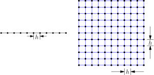   
[src/1d_grid.asy](src/1d_grid.asy)   
   
[src/1d_mappedgrid.asy](src/1d_mappedgrid.asy)   
   
[src/1dgrid.asy](src/1dgrid.asy)   
   
[src/adaplim2.asy](src/adaplim2.asy)   
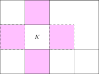   
[src/adapquad.asy](src/adapquad.asy)   
   
[src/balloon.asy](src/balloon.asy)   
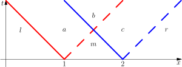   
[src/cartcoarse.asy](src/cartcoarse.asy)   
   
[src/cartrefine.asy](src/cartrefine.asy)   
   
[src/cc.asy](src/cc.asy)   
   
[src/ccell.asy](src/ccell.asy)   
   
[src/cell.asy](src/cell.asy)   
   
[src/central_fourier.asy](src/central_fourier.asy)   
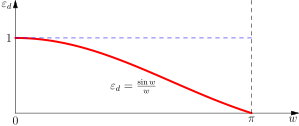   
[src/contact.asy](src/contact.asy)   
   
[src/ctu.asy](src/ctu.asy)   
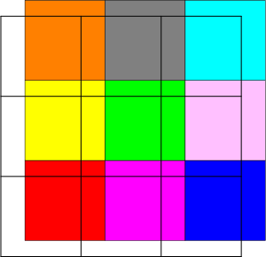   
[src/cv.asy](src/cv.asy)   
   
[src/dg_sol_nodal_gl.asy](src/dg_sol_nodal_gl.asy)   
   
[src/dg_sol_nodal.asy](src/dg_sol_nodal.asy)   
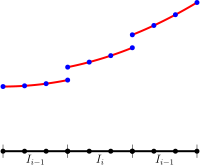   
[src/dg_sol.asy](src/dg_sol.asy)   
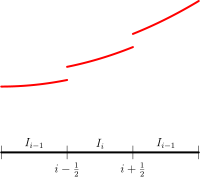   
[src/disc_sol.asy](src/disc_sol.asy)   
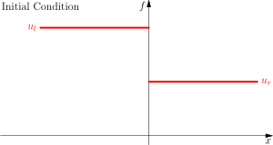   
[src/entropy_violation.asy](src/entropy_violation.asy)   
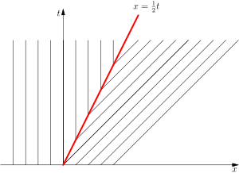   
[src/ex_rare_1.asy](src/ex_rare_1.asy)   
   
[src/ex_rare_2.asy](src/ex_rare_2.asy)   
   
[src/ex_shock_1.asy](src/ex_shock_1.asy)   
   
[src/ex_shock_2.asy](src/ex_shock_2.asy)   
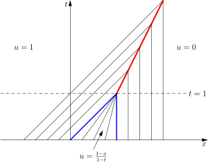   
[src/face_nbr.asy](src/face_nbr.asy)   
   
[src/fem1d_grid_p1.asy](src/fem1d_grid_p1.asy)   
   
[src/fem1d_grid_p2.asy](src/fem1d_grid_p2.asy)   
   
[src/galorth.asy](src/galorth.asy)   
   
[src/gaussquad.asy](src/gaussquad.asy)   
   
[src/inflection.asy](src/inflection.asy)   
   
[src/ivp_char.asy](src/ivp_char.asy)   
   
[src/lap2d.asy](src/lap2d.asy)   
   
[src/lap9pt.asy](src/lap9pt.asy)   
   
[src/laplace_fd_stencil.asy](src/laplace_fd_stencil.asy)   
   
[src/lin_hyp_sol.asy](src/lin_hyp_sol.asy)   
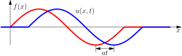   
[src/linhyp_godunov.asy](src/linhyp_godunov.asy)   
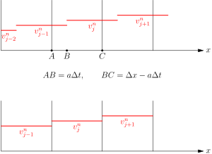   
[src/lxfflux.asy](src/lxfflux.asy)   
   
[src/mhd_corner.asy](src/mhd_corner.asy)   
   
[src/mhd_divrecon.asy](src/mhd_divrecon.asy)   
   
[src/mhd_face_dg.asy](src/mhd_face_dg.asy)   
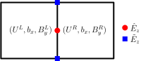   
[src/mhd_nflux.asy](src/mhd_nflux.asy)   
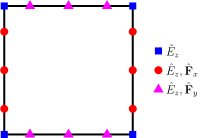   
[src/mhd_riem1d.asy](src/mhd_riem1d.asy)   
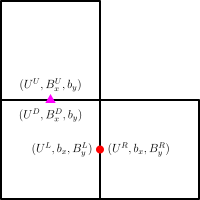   
[src/mhd_riem2da.asy](src/mhd_riem2da.asy)   
   
[src/mhd_riem2db.asy](src/mhd_riem2db.asy)   
   
[src/mhd_riem2dc.asy](src/mhd_riem2dc.asy)   
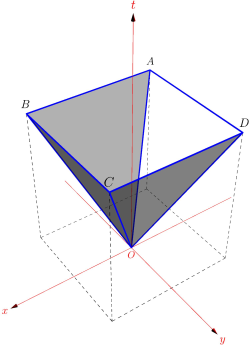   
[src/mhd_riem2dd.asy](src/mhd_riem2dd.asy)   
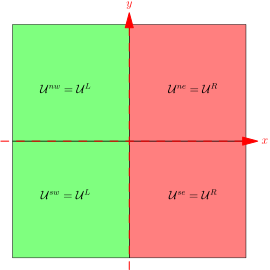   
[src/mhd_stencil.asy](src/mhd_stencil.asy)   
   
[src/mhd_vars.asy](src/mhd_vars.asy)   
   
[src/mhd_vars0.asy](src/mhd_vars0.asy)   
   
[src/mhd_yee_fd.asy](src/mhd_yee_fd.asy)   
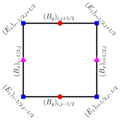   
[src/moc_disc_sol.asy](src/moc_disc_sol.asy)   
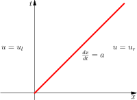   
[src/moc_fd_1.asy](src/moc_fd_1.asy)   
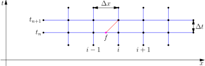   
[src/moc_fd_2.asy](src/moc_fd_2.asy)   
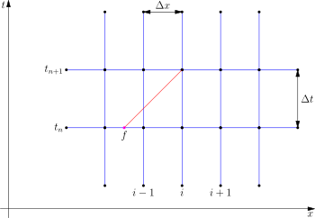   
[src/moc_fd.asy](src/moc_fd.asy)   
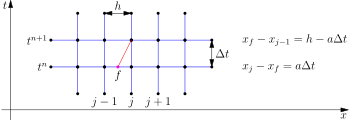   
[src/moc_finite.asy](src/moc_finite.asy)   
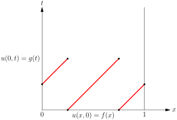   
[src/moc.asy](src/moc.asy)   
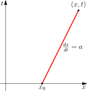   
[src/newton.asy](src/newton.asy)   
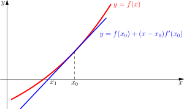   
[src/order_ndof.asy](src/order_ndof.asy)   
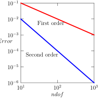   
[src/p2_dofs_basis.asy](src/p2_dofs_basis.asy)   
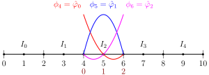   
[src/p2_dofs.asy](src/p2_dofs.asy)   
   
[src/piecewise_const.asy](src/piecewise_const.asy)   
   
[src/pos.asy](src/pos.asy)   
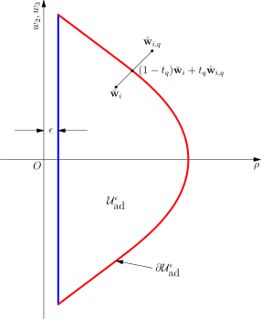   
[src/q1.asy](src/q1.asy)   
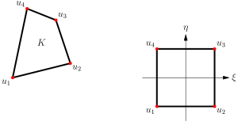   
[src/quad_aff_map.asy](src/quad_aff_map.asy)   
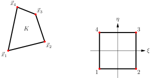   
[src/quad_aff_map1.asy](src/quad_aff_map1.asy)   
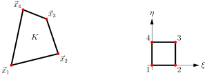   
[src/quad_q1_edge.asy](src/quad_q1_edge.asy)   
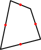   
[src/quad_q1_vert.asy](src/quad_q1_vert.asy)   
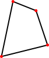   
[src/rare_ent_fix_1.asy](src/rare_ent_fix_1.asy)   
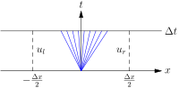   
[src/rare_ent_fix_2.asy](src/rare_ent_fix_2.asy)   
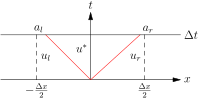   
[src/rare_ent_fix_3.asy](src/rare_ent_fix_3.asy)   
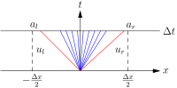   
[src/rare.asy](src/rare.asy)   
   
[src/reciprocal.asy](src/reciprocal.asy)   
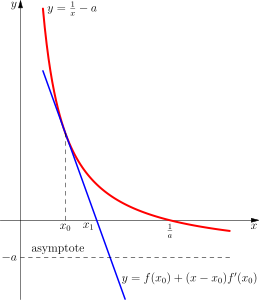   
[src/rect_aff_map.asy](src/rect_aff_map.asy)   
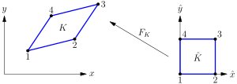   
[src/rect_p1.asy](src/rect_p1.asy)   
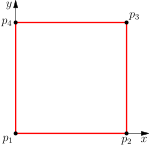   
[src/rh_proof.asy](src/rh_proof.asy)   
   
[src/riem.asy](src/riem.asy)   
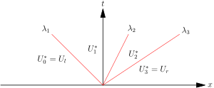   
[src/shock.asy](src/shock.asy)   
   
[src/shocktube.asy](src/shocktube.asy)   
   
[src/sinesamp3.asy](src/sinesamp3.asy)   
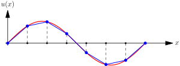   
[src/square_cart_grid.asy](src/square_cart_grid.asy)   
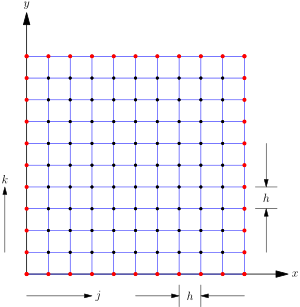   
[src/square_root.asy](src/square_root.asy)   
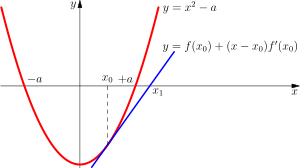   
[src/stdg.asy](src/stdg.asy)   
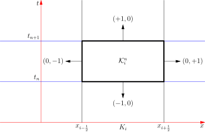   
[src/stdgdof.asy](src/stdgdof.asy)   
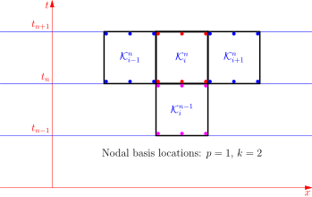   
[src/stdgmov.asy](src/stdgmov.asy)   
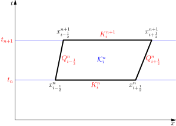   
[src/stdgmovmap.asy](src/stdgmovmap.asy)   
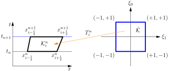   
[src/stgrid.asy](src/stgrid.asy)   
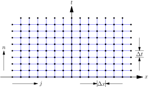   
[src/tri_aff_map.asy](src/tri_aff_map.asy)   
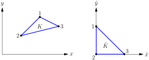   
[src/tri_p1_edge.asy](src/tri_p1_edge.asy)   
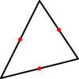   
[src/tri_p1_vert.asy](src/tri_p1_vert.asy)   
   
[src/tri_p1.asy](src/tri_p1.asy)   
   
[src/tri_p2.asy](src/tri_p2.asy)   
   
[src/u_mom_stencil.asy](src/u_mom_stencil.asy)   
   
[src/uvp_grid.asy](src/uvp_grid.asy)   
   
[src/uvp_stag.asy](src/uvp_stag.asy)   
   
[src/weak_sol.asy](src/weak_sol.asy)   
   
